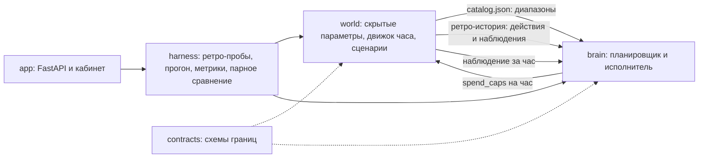

# MediaPlan Optimizer: описание проекта, промежуточная версия

Статус на 04.09.2026: работающий прототип, три демонстрации кейса проходят,
44 автотеста зелёные, запуск одной командой `docker compose up`.

## Аннотация

Сервис для рекламодателя или агентства, который сначала считает достижимый
медиаплан по восьми абстрактным каналам (три соцсети, programmatic, три
маркетплейса, SMS), а затем час за часом удерживает кампанию на траектории
плана в изменчивом рынке. Рынок заменён воспроизводимым симулятором. Ключевые
свойства: планировщик не видит скрытых параметров мира (проверяется тестом),
план объясним пошагово, недостижимая цель получает диагноз и три готовых
хода, исполнение сравнивается с «замороженным» планом на 20 парных мирах.

## Проблематика

Медиапланер обещает KPI по средним бенчмаркам и защищает распределение перед
бизнесом; трафик-менеджер после запуска сверяет факт с планом раз в день или
реже и перекладывает бюджет руками. Обе роли работают без «второй величины»:
нечем сравнить каналы между собой, цель с ёмкостью рынка, сегодняшнюю цифру с
плановой, работу автоматики с бездействием. Для кампании 1,2 млн ₽ на 21 день
запоздалое перераспределение 10–15 % бюджета стоит 120–180 тыс. ₽; для
портфеля из 20–40 кампаний это 0,5–2 млн ₽ в год плюс десятки человеко-дней.

## Постановка задачи

Proof of concept в одном веб-кабинете из трёх модулей: планировщик (типы A и
B, диагностика недостижимости), симулятор рынка (шаг один час, восемь каналов,
шоки), сервис исполнения (сверка накопленного факта с планом и
перераспределение остатка). Критерии кейса: полнота и достижимость плана,
воспроизводимость по зерну, MAPE накопительных расхода и KPI, отклонение в
конце не более 20 %, после шока результат заметно ближе к плану, чем у
замороженного распределения.

## Выбранное техническое решение

Кейс раскладывается на три известные индустриальные задачи, и для каждой
взято опубликованное решение (полный список первоисточников в
`docs/research.md`):

- **Планировщик.** Распределение по равенству предельных отдач (Little &
  Lodish, 1969; так же в аллокаторах Google Meridian и Meta Robyn) жадным
  наливанием по вогнутым кривым «дневной бюджет → показы». Кривые строятся из
  ретро-истории: пробных кампаний, прогнанных через публичный интерфейс
  симулятора в прошлых мирах, как Google Reach Planner строит прогноз по
  истории похожих кампаний. Тип B бисекцией по бюджету. Модель канала по дням
  с усталостью от частоты.
- **Симулятор.** Контракт `reset / step / inject_shock`; трафик по Пуассону с
  суточным профилем, лог-нормальный ландшафт цены (bid landscape, цена растёт
  с выкупом), охват по модели случайного размещения по пулу, AR(1)-шум по
  ключу «зерно, час, канал, событие» (общие случайные числа для честного
  сравнения стратегий), SMS пакетами в окне 9–21. Устройство стенда по образцу
  AuctionGym и открытого симулятора пейсинга Yahoo.
- **Исполнение.** Два контура (Smart Pacing, Yahoo KDD'15): внешний
  перерешает остаток тем же аллокатором на кривых, поправленных фактом;
  внутренний держит темп множителем по бандам ошибки (arXiv:2509.25429),
  цель на час по формуле Turn (ADKDD'13). Детектор слома: отдача за сутки
  против трёх суток с поправкой на плановую усталость, порог 30 % из практики
  мониторинга кампаний. Резерв бюджета: если факт по KPI опережает план, часть
  остатка не тратится так, чтобы недорасход и перевыполнение уравновесились.
- **Правило проекта.** Ни одного числа и метода из головы: `config/benchmarks.yaml`
  (публичные бенчмарки со ссылками), `config/assumptions.yaml` (допущения с
  диапазонами), `config/controller.yaml` (константы мозга с источником или
  калибровкой и тестом); `tests/test_provenance.py` это проверяет.

Архитектура:

Граница: пакет `brain` не импортирует `world` (import-linter и тест), а план
не зависит от зерна оцениваемого мира (`tests/test_isolation.py`).

## Реализованные компоненты

| Компонент | Состояние |
|---|---|
| Контракты границ (`contracts/`) | готово: каталог, наблюдение, действие, бриф, план, решение, итог |
| Симулятор (`world/`) | готово: три профиля каналов, восемь сценариев шоков, шок из интерфейса, инварианты, детерминизм |
| Планировщик (`brain/planner`) | готово: типы A и B, диагноз с тремя ходами, фиксация канала, лимит CPA, коридор, календарь, траектория |
| Исполнитель (`brain/executor`) | готово: adaptive (два контура, детектор, резерв, карточки с двумя ценами, лимит полномочий) и baseline'ы static, proportional_pacing, pid |
| Стенд (`harness/`) | готово: ретро-пробы, прогон, метрики, парное сравнение на N мирах |
| Кабинет (`app/`) | готово: бриф с пресетами, план, утверждение, стресс-тест, «что если бюджет ±10 %», прогон с воспроизведением по часам, сводка на час, таблица каналов за час, лента событий, карточки с кнопками одобрить и отклонить (цена решения по факту на общих случайных числах), итог по каналам, сравнение стратегий на 20 мирах, стенд «где ломается решение» |
| Инфраструктура | Docker и docker-compose (кабинет, тесты, стенд), 44 теста, ruff, import-linter |

## Предварительные результаты

План демо 1 (1,2 млн ₽, 21 день): 2 271 конверсий, CPA 528 ₽, восемь каналов,
предельная цена выровнена (около 1 070 ₽ за конверсию во всех незаполненных
каналах), считается за 0,1 с. Демо 2 (50 000 кликов за 14 дней): на всех
каналах достижимо за 458 тыс. ₽; на узком пресете отказ с диагнозом «набор
каналов», максимум 37 317 кликов и три хода с бюджетами. Демо 3 (шок CTR
−40 % в крупном канале с 240-го часа, один мир): наша стратегия 6,4 %
отклонения по KPI против 7,6 % у заморозки, детектор сработал через 30 часов.

Стенд, 20 парных миров, отклонение в конце кампании:

| Сценарий | Заморозка: расход / KPI | Наша: расход / KPI | Побед по KPI |
|---|---|---|---|
| без шока | 2,3 % / 20,1 % | 11,2 % / 12,0 % | 75 % |
| CTR −40 % | 2,3 % / 18,7 % | 9,3 % / 12,3 % | 85 % |
| CPM ×2 | 1,9 % / 18,9 % | 9,8 % / 12,2 % | 75 % |
| пауза канала | 4,4 % / 20,3 % | 11,2 % / 12,0 % | 80 % |

Заморозка тратит бюджет по плану, но KPI гуляет на 20 %, потому что миры
отличаются от каталога; наша стратегия выполняет план по KPI в среднем точно и
возвращает около 9 % бюджета в щедрых мирах ценой недорасхода. Детектор: шок
ловится в 11 мирах из 12 с задержкой 27–50 часов, 0,08 ложных тревог на кампанию.

## Ограничения

Аудитории каналов не пересекаются (в кейсе МТС AdTech с GFD пересечение трёх
каналов 5,3 %); цена задаётся лог-нормальным ландшафтом, а не аукционом второй
цены; охват по модели случайного размещения, а не NBD; план раскладывается
по дням равномерно; конверсии мгновенные; VTR по допущению; MAPE по KPI как
среднее по часам около 21 % у всех стратегий из-за разброса миров, в конце
кампании 12 %. Каналы абстрактные, синтетические CPM и CTR не являются
статистикой конкретной площадки.

## Открытые вопросы

- Человек в контуре: одобрить и отклонить есть, откат уже применённого хода
  пока нет. Одобрение реализовано перепрогоном на тех же случайных числах:
  для прототипа это честно и дёшево, в продукте нужен откат по журналу.
- Лимит полномочий автоматики 100 000 ₽ в демо 1 это параметр брифа,
  выставленный для показа сценария С5, а не калибровка.
- Ширина коридора плана ±34 % честно отражает неопределённость каталога, но
  визуально пугает; обсуждаем, показывать ±1σ или P25–P75.
- Резерв бюджета: держать план или выжимать максимум это продуктовый выбор;
  в кабинете есть переключатель, решение по умолчанию за продуктом.
- Интеграция мира MLE #1: наш симулятор написан по его контракту, замена
  пакета `world` не требует правок мозга.

## План работ до финала

1. Человек в контуре: откат применённого хода; журнал решений в итоге.
2. Стенд честности: деградация при смещении каталога (мир сильно отличается
   от бенчмарков), в дополнение к готовой деградации по силе шока.
3. Финальные материалы: отчёт, презентация, репетиция трёх демо.

## Команда и распределение задач

| Роль | Зона ответственности | Сделано к промежуточной версии | Участие |
|---|---|---|---|
| AI Engineer, модель мира (MLE #1) | контракт симулятора, три профиля каналов, сценарии шоков, воспроизводимость | контракт `reset/step`, документ модели мира, требования к инвариантам и общим случайным числам | активное |
| AI Engineer, мозг (MLE #2) | планировщик, исполнитель, стенд, интеграция кабинета | реализация `brain`, `harness`, `contracts`, симулятор по контракту MLE #1, кабинет, тесты, Docker, реестры констант | активное |
| AI Product | исследование пользователей, сценарии С1–С6, критерии готовности, продуктовые материалы и презентация | кабинетное исследование по шести аудиториям, шесть сценариев, правило «вторая величина», карточка с двумя ценами, лимит полномочий, стресс-тест до запуска | активное |
